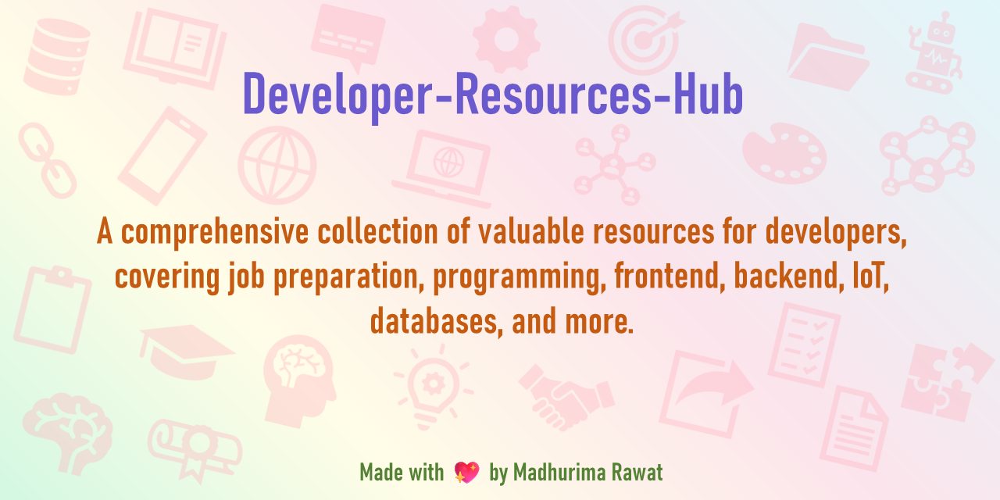
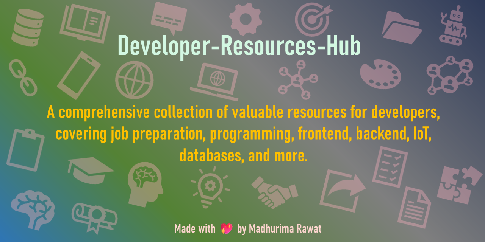

# Developer-Resources-Hub

A comprehensive collection of valuable resources for developers, covering job preparation, programming, frontend, backend, IoT, databases, and more.

<p align="center">
<a href="https://github.com/madhurimarawat/Developer-Resources-Hub"></a>
  <a href="https://github.com/madhurimarawat/Developer-Resources-Hub"></a>
</p>

<p align="center">
  <a href="https://github.com/madhurimarawat/Developer-Resources-Hub/stargazers">
    
  </a>
  <a href="https://github.com/madhurimarawat/Developer-Resources-Hub/network/members">
    
  </a>
  <a href="https://github.com/madhurimarawat/Developer-Resources-Hub">
    
  </a>
  <a href="https://github.com/madhurimarawat/Developer-Resources-Hub/blob/main/LICENSE">
    
  </a>
  
  
</p>

**Developer Resources Hub** brings together well-structured guides, tutorials, and reference materials across key domains in software development:

* 💼 **Job Preparation** – Interview questions, coding challenges, and career-building resources  
* 💻 **Programming** – Language-specific tips, examples, and foundational concepts  
* 🌐 **Frontend & Backend Development** – Framework insights, tooling, and practical workflows  
* 📡 **IoT (Internet of Things)** – Architectures, protocols, and application-level references  
* 🗄️ **Databases** – SQL/NoSQL fundamentals, query optimization, and schema design  

---

<a id="table-of-contents"></a>  
## 📌 Table of Contents

- <a href="#study-materials">📖 Study Materials</a>  
  - <a href="#useful-links">🔗 Useful Links</a>  
  - <a href="#recommended-apps">📱 Notes and To-do Lists</a>  
  - <a href="#free-courses">📚 Free Courses</a>  
  - <a href="#books-and-references">📘 Books & References</a>  
- <a href="#ai-ml-ds-resources">🧠 AI / ML / DS Resources</a>  
  - <a href="#github-repositories">📂 GitHub Repositories</a>  
  - <a href="#pdf-files">📄 PDF Files</a>  
  - <a href="#ai-links">🔗 AI / ML / DS Reference Links</a> 
- <a href="#ai-art-tools">🎨 AI Art Tools</a>
- [📲 App Links](#app-links)
- [🧠 Aptitude & Logical Reasoning](#aptitude--logical-reasoning)
- [⛓️ Blockchain](#blockchain)
- [📘 Coding Questions](#coding-questions)
- [🎨 CSS Formatter](#css-formatter)
- [🤖 Custom GPTs](#custom-gpts)
- [🗄️ Databases](#databases)
  - [🔗 General Links](#general-links)
  - [🐬 MariaDB](#mariadb)
  - [🍃 MongoDB](#mongodb)
  - [🧮 MySQL](#mysql)
  - [🧾 Oracle](#oracle)
 - [📊 DS Resources](#ds-resources)
 - [🧑‍💻 Full Stack Development](#full-stack-development)
   - [🛠️ Backend](#backend)
   - [🎨 Frontend](#frontend)
   - [📚 Books](#books)
   - [📓 Notes](#notes)
- [🧾 Graphic Designing](#graphic-designing)
- [📡 IoT Resources](#iot-resources)
- [🐧 Linux Guides](#linux-guides)
- [🧠 LLM (Large Language Models)](#llm-resources)
- [📊 Power BI](#power-bi)
- [🧩 Go Programming](#go-programming)
- [📱 Kotlin Programming](#kotlin-programming)
- [🐍 Python Programming](#python-programming)
- [🦀 Rust Programming](#rust-programming)
- [🌐 Study Resources](#study-resources)
- [📊 SAS Programming](#sas-programming)
- [🧾 HTML to PDF Conversion](#-html-to-pdf-conversion)

---

<a id="study-materials"></a>  
## 📖 Study Materials

<a id="useful-links"></a>

### 🔗 Useful Links

### 🌐 Online Presence

*Boost your visibility and career growth with these essential resources:*

* **🧑‍💼 [Mastering LinkedIn – Tips for Building Your Profile and Networking](https://www.msn.com/en-in/entertainment/hollywood/mastering-linkedin-tips-for-building-your-profile-and-networking/ss-BB1muOwj)**
  *Learn how to optimize your LinkedIn profile and expand your professional network.*

* **📝 [Brag Document – Ace Interviews and Land a Job](https://www.cnbc.com/2025/06/22/how-a-brag-doc-can-help-you-ace-interviews-and-land-a-job-says-recruiter.html)**
  *Use a brag document to track accomplishments and boost your interview confidence.*

### ✍️ Blogging Platforms

*Write articles, share ideas, and grow your developer presence online:*

* **📰 [Dev.to](https://dev.to/)**
  *A friendly community of devs writing about code, careers, and life.*

* **✒️ [Medium](https://medium.com/)**
  *A global platform for sharing tech blogs, tutorials, and opinions.*

* **🚀 [Hashnode](https://hashnode.com/)**
  *Start your own dev blog on a custom domain with no setup hassle.*

* **📘 [Substack](https://substack.com/)**
  *Publish articles or newsletters and build your audience with ease.*

* **📖 [Tealfeed](https://tealfeed.com/)**
  *Discover and write insightful content around tech, startups, and growth.*

* **🧵 [Bear Blog](https://bearblog.dev/)**
  *A minimalist, privacy-focused blogging platform for developers.*

### 📄 PDF Tools

*Convert, scan, and edit PDFs with these handy tools:*

* **✂️ [Smallpdf – Crop Tool](https://smallpdf.com/crop-pdf#r=crop-pages)**
  *Crop and resize PDF pages online — quick and user-friendly.*

### 📣 **Learning & Community Updates**

* [Prompt Engineering & Tech Updates WhatsApp Channel](https://whatsapp.com/channel/0029Vb6ISO1Fsn0kEemhE03b)
  *Stay updated with the latest in prompt engineering, AI tools, and tech trends.*

### 💼 **Selling Projects & Digital Products**

* **🛒 [Gumroad](https://gumroad.com/)**
  *A professional platform that empowers creators to monetize their knowledge and digital products, whether it’s code, design assets, or eBooks.*
  *Just start with what you know, share it with the world, and get paid. Simple and effective.*

* **🚀 [Product Hunt](https://www.producthunt.com/)**
  *A launch platform for makers to showcase their products and gain traction from a tech-savvy audience.*
  *Perfect for getting feedback, early users, and visibility for your digital creations.*
  
---

<a id="recommended-apps"></a>  
### 📱 Notes and To-do Lists

* ✅ [To-do List – Daily Planner: Android](https://play.google.com/store/apps/details?id=todolist.scheduleplanner.dailyplanner.todo.reminders&referrer=utm_source%3Duser_share) | [iOS](https://apps.apple.com/app/apple-store/id1640609657?pt=123351739&ct=andrshare&mt=8)  
  *A clean and simple task scheduler and planner for daily productivity.*

* 🗒️ [EasyNotes – Notes & Reminders: Android](https://bit.ly/EasyNotesApp) | [iOS](https://bit.ly/EasyNotesiOSApp)  
  *Colorful notepad for text and photo notes.*
  
* 🐱 [Meow To-do List (Android)](https://play.google.com/store/apps/details?id=com.glgjing.money.task.todo.list.meow)  
  *A fun and quirky task manager app.*

* 🧠 [Mind Notes – Smart Notepad (Android)](https://play.google.com/store/apps/details?id=mindnotes.note.notepad.notebook.memo.stickynotes&referrer=utm_source%3Duser_share)  
  *A visually appealing app for managing sticky notes and tasks.*

* 🗃️ [Anki Flashcards: Android](https://play.google.com/store/apps/details?id=com.ichi2.anki) | [iOS](https://apps.apple.com/app/ankimobile-flashcards/id373493387)  
  *A powerful, spaced-repetition flashcard app ideal for long-term learning and memory retention.**

---

<a id="free-courses"></a>  
### 📚 Free Courses

* 🎓 [Simplilearn Dashboard](https://lms.simplilearn.com/dashboard) – *Access your free courses and certifications.*  
* 📘 [Alison](https://alison.com/) – *Explore free online diploma and certificate courses.*  
* 💡 [Coursera](https://www.coursera.org) – *University-level courses from top institutions.*  
* 🧑‍🏫 [Udemy](https://www.udemy.com) – *Thousands of affordable courses in tech and more.*  
* 🌐 [Simplilearn](https://www.simplilearn.com/) – *Professional certificate programs and bootcamps.*

---

<a id="books-and-references"></a>  
### 📘 Books & References

* 📖 [PDFDrive](https://www.pdfdrive.to/) – *Free downloadable eBooks in various domains.*  
* 🌊 [OceanOfPDF](https://theoceanofpdf.com/) – *Library of novels, textbooks, and learning PDFs.*  
* 🎯 [GoalKicker](https://goalkicker.com/) – *Free programming books with detailed guides.*

---

<a id="ai-ml-ds-resources"></a>  
## 🧠 AI / ML / DS Resources

<a id="github-repositories"></a>  
### 📂 GitHub Repositories

* 📊 [TheAlgorithms/Python](https://github.com/TheAlgorithms/Python) – *Collection of algorithms implemented in Python.*  
* 🏗️ [System Design Primer](https://github.com/donnemartin/system-design-primer) – *Learn system design with real-world use cases.*  
* 📄 [Machine Learning Cheat Sheet](https://github.com/soulmachine/machine-learning-cheat-sheet) – *Quick ML concepts and formulas.*  
* 💯 [100 Days of ML Code](https://github.com/Avik-Jain/100-Days-Of-ML-Code) – *A step-by-step roadmap to learning ML.*  
* 🎯 [ML Interview Questions](https://github.com/khangich/machine-learning-interview) – *Comprehensive ML interview prep.*  
* 📚 [RGPV BTech Notes](https://btech-notes.rgpvnotes.in/?m=1#home) – *Engineering study notes and references.*

---

<a id="pdf-files"></a>  
### 📄 PDF Files

> *These PDFs are located in the `AI ML DS/AI ML DS/` folder.*

* 📄 [AI ML DS.pdf](AI%20ML%20DS/AI%20ML%20DS.pdf) – *Overview of AI, ML, and Data Science fields.*
* 📄 [AI Vs ML Vs DS FOR INDUSTRY.pdf](AI%20ML%20DS/AI%20Vs%20ML%20Vs%20DS%20FOR%20INDUSTRY.pdf) – *Comparison of AI, ML, and DS in practical applications.*
* 📄 [Data Science Interview.pdf](AI%20ML%20DS/Data%20Science%20Interview.pdf) – *Key questions and answers for DS job interviews.*
* 📄 [Difference Between DS AI AND DL.pdf](AI%20ML%20DS/Difference%20Between%20DS%20AI%20AND%20DL.pdf) – *Distinguishes Data Science, AI, and Deep Learning.*
* 📄 [Difference Between DS AI AND ML.pdf](AI%20ML%20DS/Difference%20Between%20DS%20AI%20AND%20ML.pdf) – *Clarifies the overlap and differences among fields.*
* 📄 [Difference Between DS AI AND ML-2.pdf](AI%20ML%20DS/Difference%20Between%20DS%20AI%20AND%20ML-2.pdf) – *Extended explanation of ML, DS, and AI relationships.*

---

<a id="ai-links"></a>

### 🔗 AI / ML / DS Reference Links

> *These web links provide additional insights and articles related to AI, ML, DL, and Data Science.*

* 🧠 [AI Vs ML Vs DS FOR INDUSTRY – Braincube](https://braincube.com/resource/manufacturing-ai-vs-machine-learning-vs-data-science/#:~:text=Data%20Science%20involves%20analysis%2C%20visualization,and%20makes%20use%20of%20algorithms)
  *A comprehensive guide comparing AI, ML, and Data Science in the manufacturing industry.*

* 🧩 [Difference Between AI, ML, and DL – GeeksforGeeks](https://www.geeksforgeeks.org/difference-between-artificial-intelligence-vs-machine-learning-vs-deep-learning/)
  *Breakdown of how Artificial Intelligence, Machine Learning, and Deep Learning differ.*

* 📘 [Difference Between DS, AI and ML – MyGreatLearning](https://www.mygreatlearning.com/blog/difference-data-science-machine-learning-ai/#:~:text=Artificial%20Intelligence%20uses%20logic%20and,are%20popular%20applications%20of%20AI)
  *Explains how Data Science, AI, and ML intersect and diverge.*

* 🧪 [DS vs AI vs ML – Rice University](https://csweb.rice.edu/academics/graduate-programs/online-mds/blog/data-science-vs-ai-and-ml)
  *Insights from Rice University into the distinctions between these fields.*

---

<a id="ai-art-tools"></a>  
## 🎨 AI Art Tools

* 🎨 [Bing Image Creator](https://www.bing.com/create) – *Generate AI images from text prompts using DALL·E.*  
* 🧠 [Midjourney](https://midjourney.com/) – *Advanced AI art generation via Discord-based workflow.*

---
<a id="app-links"></a>

## 📲 App Links

### 🛠️ Dev Apps

Stay connected, explore resources, and boost productivity with these mobile apps made for developers:

* **📚 [Cheat Sheets](https://play.google.com/store/apps/details?id=com.ivansaul.cheatsheets)**
  *Quickly access programming cheat sheets for multiple languages.*

* **🗓️ [Daily.dev](https://play.google.com/store/apps/details?id=dev.daily)**
  *Developer news and articles curated from top sources, delivered daily.*

* **⚡ [DevBytes](https://play.google.com/store/apps/details?id=com.candelalabs.devbytes)**
  *Byte-sized tech content and developer tips to help you learn something new every day.*
  *A standout feature: it displays the user Streak in the logo to encourage consistent learning.*

* **👩‍💻 [Forem (DEV Community)](https://play.google.com/store/apps/details?id=com.forem.android)**
  *Engage with devs, read blogs, and join discussions right from your phone.*

* **:octocat: [GitHub for Android](https://play.google.com/store/apps/details?id=com.github.android)**
  *Manage repos, issues, pull requests, and more – on the go.*

### 📄 PDF Tools

*Convert, scan, and edit PDFs with these handy tools:*

* **📷 [Adobe Scan](https://adobescan.app.link/LYfBUdFMlY)**
  *Scan documents and convert them into clean, shareable PDFs easily.*

---

<a id="aptitude--logical-reasoning"></a>

## 🧠 Aptitude & Logical Reasoning

* 📘 [R. S. Aggarwal Book – Download Link](https://drive.google.com/u/0/uc?id=1MP0I7nqFONaW6K102eJqyNraFv2SwvLp&export=download)
  *Widely used book for aptitude and reasoning preparation.*

> 📄 PDF Files available in `Aptitude and Logical Reasoning/` folder:

* [Answer Key.pdf](Aptitude%20and%20Logical%20Reasoning/Answer%20Key.pdf)
* [Aptitude Test.pdf](Aptitude%20and%20Logical%20Reasoning/Aptitude%20Test.pdf)

---

<a id="blockchain"></a>

## ⛓️ Blockchain

### 📖 Concepts and Notes

*What is decentralization? Why is it essential to blockchain technology? Learn key principles such as smart contracts, DApps, and privacy in this file:*
📄 [`Blockchain.txt`](Blockchain/Blockchain.txt)

### 📘 Books & Learning Resources

* 📗 [Blockchain Basics – Blockchain Training Alliance](https://blockchaintrainingalliance.com/products/blockchain-basics)
  *Beginner-friendly overview of blockchain concepts and applications.*

* 📕 [MRCET Blockchain Lecture Notes (PDF)](https://mrcet.com/downloads/digital_notes/CSE/IV%20Year/CSE%20B.TECH%20IV%20YEAR%20II%20SEM%20BCT%20%28R18A0534%29%20NOTES%20Final%20PDF.pdf)
  *Academic-level PDF notes for students learning blockchain.*

* 📘 [What is Blockchain – BSV Association eBook](https://bsvassociation.org/e-book/what-is-blockchain-ebook/)
  *A freely accessible eBook explaining blockchain fundamentals.*

---


<a id="coding-questions"></a>

## 📘 Coding Questions

> 📄 PDF Files available in `Coding Questions/` folder:

* 📄 [20 Coding Patterns to Master MAANG Interviews.pdf](Coding%20Questions/20%20Coding%20Patterns%20to%20master%20MAANG%20Interviews.pdf)
  *Essential coding patterns for cracking top tech interviews.*

* 📄 [Zero to Advance DSA Questions.pdf](Coding%20Questions/Zero%20to%20Advance%20DSA%20Questions.pdf)
  *Comprehensive DSA problem set from basics to advanced.*

---

<a id="css-formatter"></a>

## 🎨 CSS Formatter

* 🎨 [ArtDriveThru CSS Formatter Tool](https://artdrivethru.com/about)
  *Online CSS beautifier and formatter for front-end developers.*

---

<a id="custom-gpts"></a>

## 🤖 Custom GPTs

> 📄 PDF Files available in `Custom GPT/` folder:

* 📄 [Gesture(12+Custom+GPTs).pdf](Custom%20GPT/Gesture%2812%2BCustom%2BGPTs%29.pdf)
  *Descriptions and links to custom GPTs for automation and productivity.*

---

<a id="databases"></a>

## 🗄️ Databases

<a id="general-links"></a>

### 🔗 General Links

* 📚 [Advanced Database Concepts – ExploreDatabase](https://www.exploredatabase.com/p/advanced-database-concepts.html)
  *Detailed insights on modern database designs and use cases.*
  
---

<a id="mariadb"></a>

### 🐬 MariaDB

* 📘 [MariaDB Notes PDF – Plymouth University](https://turing.plymouth.edu/~zshen/Webfiles/notes/CS3600/labNotes/mariaDBNotes.pdf)
* 📘 [MariaDB Tutorial PDF – TutorialsPoint](https://www.tutorialspoint.com/mariadb/mariadb_tutorial.pdf)
* 🌐 [MariaDB Server PDF Resources](https://mariadb.org/mariadbserverpdf/)

---

<a id="mongodb"></a>

### 🍃 MongoDB

* 📚 [The Little MongoDB Book – GitHub](https://github.com/karlseguin/the-little-mongodb-book)
* 📘 [Practical MongoDB PDF – BMC Software](https://www.bmcsoftware.fr/content/dam/bmc/collateral/bmc/523425-MongoDB-eBook-07292020.pdf)
* 📖 [MongoDB Beginner Guide PDF](https://content.e-bookshelf.de/media/reading/L-3949224-ced2b8e890.pdf)
* 📝 [MongoDB Handwritten Notes – TopperWorld](https://topperworld.in/mongodb-handwritten-notes/#pdf-mongodb-handwritten-notes/9/)
* 📘 [Free MongoDB PDF Tutorials – FromDev](https://www.fromdev.com/2019/01/best-free-mongodb-tutorials-pdf.html?amp=1)

---

<a id="mysql"></a>

### 🧮 MySQL

* 🔍 [SQL Personalities Quiz – LearnSQL](https://learnsql.com/blog/sql-personalities/)
  *Interactive guide to explore your database mindset.*

---

<a id="oracle"></a>

### 🧾 Oracle

* 📘 [Oracle Database Concepts PDF (Official Docs)](https://docs.oracle.com/en/database/oracle/oracle-database/19/cncpt/database-concepts.pdf)
  *Oracle’s official concepts documentation for version 19c.*

---
<a id="ds-resources"></a>

## 📊 DS Resources

* 📬 [Free Daily Dose of Data Science PDF Newsletter](https://blog.dailydoseofds.com/p/free-daily-dose-of-data-science-pdf)
  *Curated daily insights into the world of data science.*

* 🧪 [Assessment Quiz – Know What to Learn Next](https://bit.ly/DS-assessment)
  *Take a quick assessment to identify your weak topics.*
  
* 🧠 [5 Ways to Transition Into AI from Non-Tech Background – KDnuggets](https://www.kdnuggets.com/5-ways-to-transition-into-ai-from-a-non-tech-background)
  *Guidance for shifting into AI and ML roles from a non-technical background.*

* 💼 [5 Free Resources for DS Job Search – KDnuggets](https://www.kdnuggets.com/5-free-resources-to-master-your-data-science-job-search)
  *Free, curated tools to boost your data science job hunt.*
  
---

<a id="full-stack-development"></a>

## 🧑‍💻 Full Stack Development

<a id="backend"></a>

### 🛠️ Backend

* 💬 [Join the Backend Developers Discord Server](https://discord.gg/GMeAG9BVuD)
  *Community for discussing backend frameworks and tools.*

* 🔗 [MySQL Search Form with HTML + PHP – Eli The Computer Guy](https://www.elithecomputerguy.com/2019/12/mysql-search-form-with-html-and-php/)

* 🔍 [PHP MySQL Select – W3Schools](https://www.w3schools.com/php/php_mysql_select.asp)
  *Learn how to query MySQL databases using PHP.*

* 🎥 [Lecture 1 – Backend Fundamentals (YouTube)](https://youtube.com/live/TDP7djYhGAU?feature=share)

<a id="backend-notes"></a>

#### 📓 Notes

> 📄 PDF Files available in `Notes/` folder:

* 📄 [30-Day Challenge to Learn MERN Stack.pdf](Notes/30-Day%20Challenge%20to%20Learn%20MERN%20Stack.pdf)
  *Daily learning structure to master MERN stack in a month.*

* 📄 [Java Basic Concept Notes.pdf](Notes/Java%20Basic%20Concept%20Notes.pdf)
  *Key Java concepts in a simplified format.*

* 📄 [Java.pdf](Notes/Java.pdf)
  *Comprehensive guide to Java programming.*

* 📄 [Lecture 13 – Backend Development.pdf](Notes/Lecture%2013%20-%20Backend%20Development.pdf)
  *Lecture slides covering backend fundamentals.*


---

<a id="frontend"></a>

### 🎨 Frontend

* 📘 [JavaScript Algorithms GitHub Repo](https://github.com/trekhleb/javascript-algorithms)
  *Collection of JavaScript algorithms explained and implemented.*

* 💻 **JavaScript Projects by CodeWithFaraz**

  * [Fruit Slicer Game](https://www.codewithfaraz.com/content/303/building-a-fruit-slicer-game-with-html-css-and-javascript-source-code)
  * [Browser Detector](https://www.codewithfaraz.com/content/260/creating-a-browser-detector-with-html-css-and-javascript)
  * [WhatsApp Web UI Clone](https://www.codewithfaraz.com/content/114/create-a-whatsapp-web-interface-clone-using-html-and-css)
  * [Who’s That Pokémon JS Game – Dev.to](https://dev.to/codingcss/whos-that-pokemon-javascript-project-45m5)

* 🎨 [Learn CSS – Web.Dev Interactive Course](https://web.dev/learn/css/?gclid=CjwKCAiAhJWsBhAaEiwAmrNyq7diJcdiPFwCMteAeNW83eE98qwMiHF_zD80SZkdyznxHVX5fHs87hoCRUoQAvD_BwE)

* ❓ **Frontend Trivia**

🗂️ Questions sourced from [`Full Stack Development/Frontend/Questions.txt`](Full%20Stack%20Development/Frontend/Questions.txt)

  > **Q1:** How many characters can be written in 1KB?
  
  > **A)** 1048 **B)** 1024 **C)** 1042 **D)** 1000
  > ✅ **Answer:** B) 1024

---

<a id="books"></a>

## 📚 Books

> 📄 PDF Files available in `Full Stack Development/Books/` folder:

* 📄 [Web Development with Node & Express.pdf](Full%20Stack%20Development/Books/Web_Development_with_Node_Express.pdf)
  *Learn backend development using Express.js.*

* 📄 [The Full Stack Developer Guide (PDFDrive)](Full%20Stack%20Development/Books/The%20Full%20Stack%20Developer_%20Your%20Essential%20Guide%20to%20the%20Everyday%20Skills%20Expected%20of%20a%20Modern%20Full%20Stack%20Web%20Developer%20%28%20PDFDrive%20%29.pdf)
  *Essential full-stack skills for modern web developers.*

---

<a id="notes"></a>

## 📓 Notes
* 📄 [Full Stack Introduction.pdf](Full%20Stack%20Development/Notes/Full%20Stack%20Introduction.pdf)
  *Introductory overview of full stack development and its components.*

---

<a id="graphic-designing"></a>
## 🧾 Graphic Designing

### 📄 PDF Files

* 📄 [Graphic Design Basics.pdf](Graphic%20Designing/Graphic%20Design%20Basics.pdf)  
  *Fundamentals of layout, typography, and visual design principles.*

* 📄 [Graphic-Designing-Notes.pdf](Graphic%20Designing/Graphic-Designing-Notes.pdf)  
  *Comprehensive notes on various graphic designing topics.*

---

<a id="iot-resources"></a>
## 📡 IoT Resources

### 🔗 Book Link

* 📘 [IoT & Applications Digital Notes – MRCET](https://mrcet.com/downloads/digital_notes/EEE/IoT%20&%20Applications%20Digital%20Notes.pdf)  
  *Core material for understanding IoT fundamentals and its applications.*

---

<a id="linux-guides"></a>
## 🐧 Linux Guides

### 🔗 Website Links

* 📂 [Linux Directory Listing – Part 1](https://linuxsurvival.com/linux-directory-listing-part-1/)
* 📂 [Linux Boot Process Overview](https://linuxjourney.com/lesson/boot-process-overview)  
  *Interactive and beginner-friendly Linux tutorials.*

---

<a id="llm-resources"></a>
## 🧠 LLM (Large Language Models)

### 📂 Useful Links

* 🔗 [LLM Course GitHub](https://github.com/mlabonne/llm-course)
* 🔗 [LLM List – GitHub Stars by Madhurima](https://github.com/stars/madhurimarawat/lists/llm-large-language-models)
* 🔗 [LangChain with Hugging Face](https://www.analyticsvidhya.com/blog/2023/12/implement-huggingface-models-using-langchain/)
* 🔗 [Gemini Pro LLM – LangChain JS](https://dev.to/oyemade/getting-started-w-googles-gemini-pro-llm-using-langchain-js-4o1)
* 🔗 [Top 8 LLMs & DL Repos](https://dev.to/quine/8-llms-and-deep-learning-repos-to-get-you-into-the-top-1-108g)

### 📄 PDF File

* 📄 [LLM Introduction.pdf](LLM/LLM%20Introduction.pdf)  
  *Beginner-friendly overview of LLM concepts and tools.*

---

<a id="power-bi"></a>
## 📊 Power BI

### 🔗 Website Resources

* 📘 [DataCamp: Power BI for Beginners](https://www.datacamp.com/tutorial/tutorial-power-bi-for-beginners)
* 📘 [GFG: Power BI Tutorial](https://www.geeksforgeeks.org/power-bi-tutorial/)
* 📘 [Power BI Desktop Guide (Medium)](https://medium.com/@arjunuttamsharma561/power-bi-desktop-for-beginners-b3c2bbac27e4)

### 📂 PDF Guides

* 📄 [Microsoft Power BI – Mobile PDF Guide](https://www.bing.com/ck/a?!&&p=fd9a35213e42a8aa1b41752c690f49b72e015486fac4ddc2d38eac556c2b29cdJmltdHM9MTc1MjI3ODQwMA&ptn=3&ver=2&hsh=4&fclid=38cd0206-549a-643c-18ed-17f9550165b0&psq=Introduction+to+Power+BI+pdf&u=a1aHR0cHM6Ly9kb3dubG9hZC5taWNyb3NvZnQuY29tL2Rvd25sb2FkLzAvOC8xLzA4MTZGOEQxLUQxQTUtNEY2MC05QUY1LUJDOTFFMThENkQ2NC9NaWNyb3NvZnRfUHJlc3NfZWJvb2tfSW50cm9kdWNpbmdfUG93ZXJfQklfUERGX21vYmlsZS5wZGY&ntb=1)
* 📄 [Introduction to Microsoft Power BI – GitHub](https://github.com/ambarishan/PowerBIFiles/blob/main/01%20-%20Introduction%20to%20Microsoft%20Power%20BI.pdf)
* 📄 [Monash Power BI Course](https://monashdatafluency.github.io/Power_BI/)
* 📄 [Power BI for Beginners (2020)](https://thetacdn.blob.core.windows.net/assets/2021:PowerBIGuides/Power%20BI%20for%20Beginners%20-%202020.pdf)
* 📄 [End-to-End Analytics with Power BI](https://data-mozart.com/wp-content/uploads/2022/01/END-TO-END-ANALYTICS-WITH-MICROSOFT-POWER-BI.pdf)

---
<a id="go-programming"></a>
## 🧩 Go Programming

### 🔗 Project Links

* 📺 [Learn Go Programming by Building 11 Projects](https://www.youtube.com/watch?v=jFfo23yIWac)  
  *A comprehensive YouTube tutorial for hands-on Go learning.*

* 🧠 [Building a Type-Safe Go Backend for React](https://dev.to/encore/building-a-type-safe-go-backend-for-a-react-web-app-3hmf)  
  *Dev article explaining how to integrate a robust Go backend with React.*

---

<a id="kotlin-programming"></a>
## 📱 Kotlin Programming

### 🔗 Project Link

* 📺 [Simple Kotlin App | Android Studio | 2024](https://www.youtube.com/watch?v=XLt_moCoauw)  
  *Tutorial for building a simple Kotlin Android app using Android Studio.*

---

<a id="python-programming"></a>
## 🐍 Python Programming

### 🔗 GitHub Repositories

* 📘 [10 GitHub Repositories to Master Python](https://www.kdnuggets.com/10-github-repositories-to-master-python)  
  *A curated list of top Python learning resources and projects.*

### 📚 Interactive Notebooks

* 📓 [Marimo](https://github.com/marimo-team/marimo)  
  *A Python-based reactive notebook built for developers—clean, fast, and ideal for dashboards and reports.*

* 📔 [Jupyter Notebook](https://jupyter.org/)  
  *A powerful open-source web app to create and share documents containing live code, equations, and visualizations.*

* 📗 [Google Colab](https://colab.research.google.com/)  
  *A free cloud service from Google that supports Python notebooks with GPU/TPU support and zero setup.*

### 🧠 Beginner-Friendly Articles

* 📘 [Python for Absolute Beginners – freeCodeCamp](https://www.freecodecamp.org/news/learning-python-from-zero-to-hero-120ea540b567)  
  *A comprehensive guide to get started with Python from scratch.*

* 📙 [Learn Python – W3Schools](https://www.w3schools.com/python/)  
  *Interactive lessons to grasp Python syntax, logic, and functions step-by-step.*

* 📕 [Real Python – Beginner’s Roadmap](https://realpython.com/learning-paths/beginner/)  
  *Structured learning paths for those new to Python, covering basics to real-world projects.*

---

<a id="rust-programming"></a>
## 🦀 Rust Programming

### 🔗 Project Link

* 📺 [Getting Started with Rust – Projects Playlist](https://www.youtube.com/watch?v=wHDYReCysVY)  
  *Video walkthrough on building Rust projects from scratch.*

---

<a id="study-resources"></a>
## 🌐 Study Resources

* 🌐 [Learn Anywhere – Rumie](https://learn.rumie.org/jR/)  
* 🌐 [GoalKicker – Free Programming Books](https://goalkicker.com/)  
* 🌐 [KodeKloud](https://kodekloud.com/)  
* 🌐 [KodeKloud Learning Portal](https://learn.kodekloud.com/)  
* 🌐 [Engineers Planet – Resources](https://engineersplanet.com/)  
* 🌐 [Engineers Planet – Learning Portal](https://learn.engineersplanet.com/)  
* 🌐 [Engineers Planet GitHub – ML/DL Resources](https://github.com/engineers-planet/Machine-Learning_Deep-learning_Free-Download/tree/381de74cb080305f43ffb710db13f3e6f5ce54e0)  

---

<a id="sas-programming"></a>
## 📊 SAS Programming

### 📄 PDF File

* 📄 [Introduction To SAS Programming.pdf](SAS/Introduction%20To%20SAS%20Programming.pdf)  
  *Foundational guide to understanding SAS programming basics.*

### 🔗 Extra Reading

* 📘 [SAS Intro Guide – ECU](https://ofe.ecu.edu/wp-content/pv-uploads/sites/277/2021/05/SAS_intro_2021OFE.pdf)  
  *Official SAS intro document from East Carolina University.*

---

<a id="html-to-pdf-conversion"></a>

## 🧾 HTML to PDF Conversion

Convert HTML files to PDF using browser tools, command-line utilities, Python, or online services.

### 🔹 1. Using Google Chrome or Any Browser (Easy Method)

1. Open the HTML file in your browser (Chrome, Edge, Firefox).
2. Press `Ctrl + P` (Windows/Linux) or `Cmd + P` (Mac) to open the **Print** dialog.
3. In the **Destination** section, select **Save as PDF**.
4. Click **Save**, choose a location, and save the file.

### 🔹 2. Using `wkhtmltopdf` (Command Line)

A powerful tool to convert HTML to PDF via terminal.

#### ✅ Install `wkhtmltopdf`

- **Ubuntu/Debian:**
  ```bash
  sudo apt install wkhtmltopdf
  ```

* **Mac (Homebrew):**

  ```bash
  brew install wkhtmltopdf
  ```
* **Windows:** Download from [wkhtmltopdf.org](https://wkhtmltopdf.org/downloads.html)

#### 🔁 Convert HTML to PDF

```bash
wkhtmltopdf input.html output.pdf
```

### 🔹 3. Using Python (Automated)

Automate the conversion with Python using `pdfkit`.

#### ✅ Install Dependencies

```bash
pip install pdfkit
sudo apt install wkhtmltopdf
```

#### 💡 Python Script

```python
import pdfkit
pdfkit.from_file("input.html", "output.pdf")
```

### 🔹 4. Using an Online Tool

No setup needed—just upload your file and convert:

* 🌐 [Sejda HTML to PDF](https://www.sejda.com/html-to-pdf)
* 🌐 [PDFCrowd](https://www.pdfcrowd.com/)

---

## Thanks for Visiting 😄

- Drop a 🌟 if you find this repository useful.<br><br>
- If you have any doubts or suggestions, feel free to reach me.<br><br>
📫 How to reach me:  &nbsp; [](https://www.linkedin.com/in/madhurima-rawat/) &nbsp; &nbsp;
<a href ="mailto:rawatmadhurima@gmail.com"> </a><br><br>
- **Contribute and Discuss:** Feel free to open <a href= "https://github.com/madhurimarawat/Developer-Resources-Hub/issues">issues 🐛</a>, submit <a href = "https://github.com/madhurimarawat/Developer-Resources-Hub/pulls">pull requests 🛠️</a>, or start <a href = "https://github.com/madhurimarawat/Developer-Resources-Hub/discussions">discussions 💬</a> to help improve this repository!
